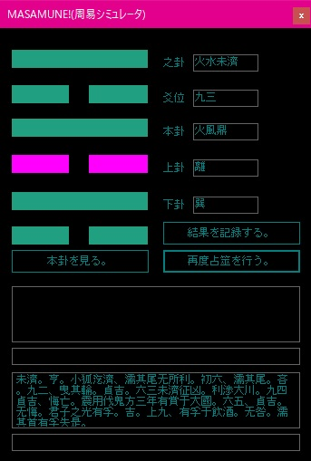
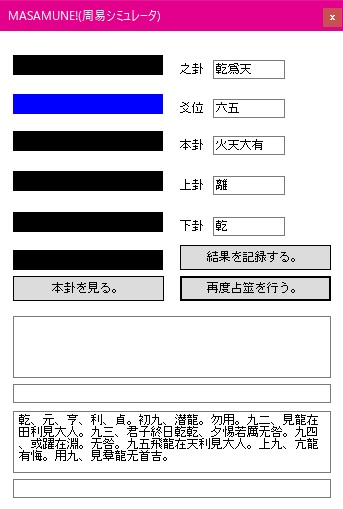

# MASAMUNE!
 
周易シミュレータ "MASAMUNE!".

本ソフトウェアは, 周易（略筮法）をシミュレートします.
 
# DEMO

 

# Features
 
"MASAMUNE!" は, 実際の略筮法による占筮の手順を正確にシミュレートします.

（ネイティブコードにて動作確認済みです）
 
# Requirement / Installation
 
任意のディレクトリにcloneして, VisualStudioでビルド・実行して下さい.
 
* [Microsoft Visual Studio 2019](https://visualstudio.microsoft.com/ja/downloads/)
 
# Usage
 
プログラムが起動したら, "易占を行う。" ボタンを押下し, 占筮を開始します.

結果は, ウインドウ上部に卦象, 下部に易経本文が表示されます.

.exe.config内の "BlackColorSettings" プロパティにて, 黒色／白色を設定できます.

※空欄は将来用です. 何を出力するかまだ決めていません...
 
# Note
 
本ソフトウェアは, 易の基礎知識を持っていて, そこそこの占筮経験を積んだ方向けです.

"筮竹を出さなくて済む" というだけの理由で制作いたしましたので, その他の占筮のセオリーは守って下さい.
 
# Author
 
* Designed & Programmed by H.Asaba
* t: [@Belboz16](https://twitter.com/belboz16)
* a: https://www.amazon.co.jp/-/e/B01FBJGMBK
 
# License
 
"MASAMUNE!" is under [MIT license](https://en.wikipedia.org/wiki/MIT_License).

have a good one!
